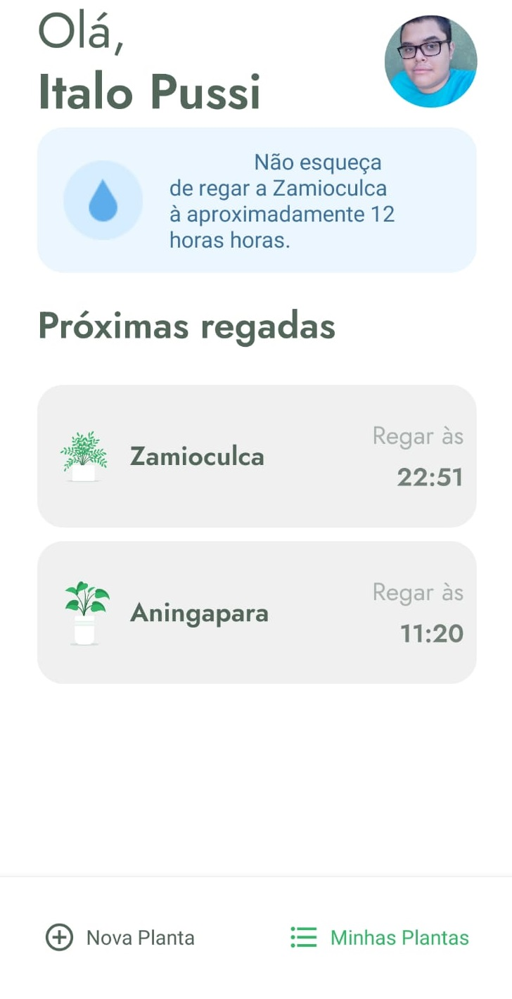
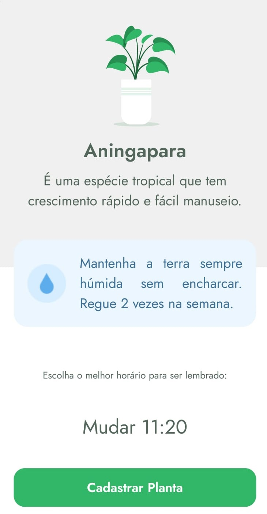

<h1 align="center">Plant Manager</h1>
<div align="right">
    <a href="https://github.com/ItaloPussi/NLW5/blob/master/plantmanager-mobile/readme.md" />English Version</a>
</div>

<h1 align="center">
  <a href="https://github.com/ItaloPussi/NLW5/tree/master/plantmanager-mobile" target="_blank">
    
  </a>
</h1>

<p>🚀 Plant Manager é uma aplicação que foi desenvolvida durante a 5ª edicão da Next Level Week. Nela podemos gerenciar os horários de regar suas plantinhas.</p>

<p align="center">
 <a href="#projeto">Projeto</a> •
 <a href="#tecnologias">Tecnologias</a> • 
 <a href="#contribuicao">Contribuição</a> • 
 <a href="#creditos">Creditos</a> • 
 <a href="#licenca">Licença</a>
</p>

<h2 id="projeto">Projeto</h2>
<div>
    
    
    
</div>
<br />

<p>Para testar a aplicação na sua máquina é necessário possuir o <a href="https://nodejs.org/en/download/ target="_blank">NodeJs</a> e o <a href="https://docs.expo.io/get-started/installation/" target="_blank">Expo</a> instalado em sua máquina.</p>
<p> Agora siga os passos abaixos no terminal:</p>

```bash
  # Clone esse repositório
  git clone https://github.com/ItaloPussi/NLW5/
  
  # Navegue para a pasta desse projeto
  cd NLW5/plantmanager-mobile
  
  # Instale as dependências
  npm install
  
  # Agora duplique o terminal:
  start cmd.exe
  
  # Em uma das janelas digite o comando abaixo:
  npm run server
  
  # Na outra, o comando a seguir:
  expo start
  
  # Expo irá abrir uma nova janela, siga os passos na tela para rodar o aplicativo em seu dispositivo (ou emulador).
  # É importante mudar o IP que está em src/services/api.ts para o seu IP local.
 ```
 
<h2 id="tecnologias">Tecnologias</h2>
<ul>
  <li>React Native</li>
  <li>React Native Gesture handler</li>
  <li>React Native Lottie</li>
  <li>Date FNS</li>
  <li>JSON Server</li>
  <li>Axios</li>
</ul>

<h2 id="contribuicao">Contribuição</h2>
<p>Achou algum bug ou tem uma contribuição a fazer? Sinta-se livre.</p>

<h2 id="creditos">Creditos</h2>
<p>Esse projeto foi criado durante a 5ª edição da <a href="https://nextlevelweek.com/" target="_blank">Next Level Week</a>.</p>

<h2 id="licenca">Licença</h2>
<a href="https://choosealicense.com/licenses/mit/" target="_blank" />MIT</a>

