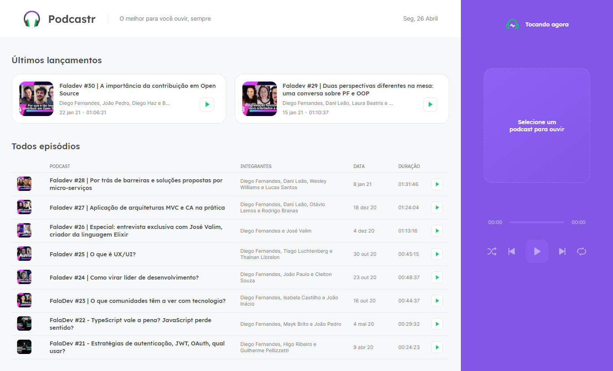

<h1 align="center">NLW #5</h1>

    <a href="https://github.com/ItaloPussi/NLW5/blob/master/readme.md" />English Version</a>

<h1 align="center">
  
  
</h1>

🚀 Nesse repositório você encontrará dois projetos criados na 5ª edição da Next Level Week. Verifique os subdiretórios desse projeto para ler mais.

 <a href="#contribuicao">Contribuição</a> • 
 <a href="#creditos">Creditos</a> • 
 <a href="#licenca">Licença</a>

<h2 id="contribuicao">Contribuição</h2>

Achou algum bug ou tem uma contribuição a fazer? Sinta-se livre.

<h2 id="creditos">Creditos</h2>

Os projetos disponíveis nesse diretório foram criados durante a 5ª edição da <a href="https://nextlevelweek.com/" target="_blank">Next Level Week</a>.

<h2 id="licenca">Licença</h2>
<a href="https://choosealicense.com/licenses/mit/" target="_blank" />MIT</a>

